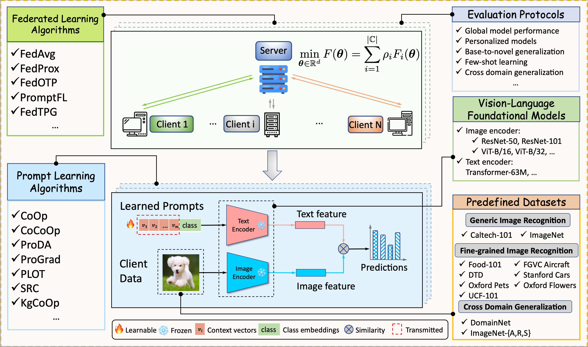

# FLiP: Towards Comprehensive and Reliable Evaluation of Federated Prompt Learning
<h1 align="center">
    
</h1>


# Brief Introduction of FLiP
FLiP is a comprehensive benchmark suite for large-scale evaluation of federated prompt learning methods, particularly on vision tasks.
It integrates a rich set of federated prompt learning algorithms to provide a reproducible benchmark with aligned experimental settings to track the cutting-edge advancements in this field.
FLiP also offers off-the-shelf highly-reusable functionalities for flexible customization and agile developing of novel federated prompt learning algorithms.
Blessed by the decoupled design of federated learning and prompt learning modules,
it can be readily extended to harvest the progress from federated learning and prompt learning communities.
FLiP is also remarkably more convenient to use than modifying centralized prompt learning repos to adapt to federated settings.

# The Overall System Design of FLiP
<h1 align="center">
    
</h1>

FLiP offers modularized design of each components.
In this way,
it is capable of integrating a rich collection of federated learning
and prompt learning algorithms,
providing unified data loading interface on
a wide variety of datasets
under comprehensive evaluation protocols.
It is also under active development and will continuously include more models, tasks, and functionalities for federated prompt learning.

# High-level Overview of Code Structure
```
FLiP
├── flcore
│   ├── clients                  # local training algorithms for clients
│   │   ├── client_base.py
│   │   ├── client_fedavg.py
│   │   └── client_fedotp.py
│   ├── datasets                 # dataset partition and processing
│   │   ├── base.py
│   │   ├── caltech101.py
│   │   ├── domain_net.py
│   │   ├── imagenet.py
│   │   ├── ...
│   │   ├── imageloader.py
│   │   ├── info.py
│   │   ├── randaugment.py
│   │   ├── randtransform.py
│   │   └── utils.py
│   ├── models                   # model configurations
│   │   ├── clip                 # CLIP models and prompt learning algorithms
│   │   ├── cnn
│   │   ├── __init__.py
│   │   ├── text
│   │   └── utils.py
│   ├── optimizers               # customizable optimizers
│   │   ├── __init__.py
│   │   ├── sam.py
│   │   └── utils.py
│   ├── pretty
│   │   ├── history.py
│   │   └── logger.py
│   ├── servers                  # global aggregation algorithms on server
│   │   ├── ground_metric.py
│   │   ├── server_base.py
│   │   ├── server_fedavg.py
│   │   └── server_fedotp.py
│   └── utils.py
├── main.py
├── scripts                      # shell scripts for reproducing results
│   └── run_batch.sh
└── tools                        # misc tools for building envs, dataset processing, etc
    └── install_pt_2100.sh
```

# Setup Environments
We use Anaconda to install and manage the required Python packages.
We provide the shell script for setting up the environments, which is `/tools/install_pt_2100.sh` shown as follows:

```
conda create -n pt-2100 python=3.10.14 -y
source ${HOME}/app/anaconda3/bin/activate pt-2100   # need customization
conda install -y pytorch==2.1.0 torchvision==0.16.0 torchaudio==2.1.0 pytorch-cuda=12.1 -c pytorch -c nvidia
conda install -y matplotlib pandas
conda install -y tensorboard tensorboardx
conda install -y tqdm scikit-learn termcolor
conda install -c conda-forge opencv -y

conda install -y numpy==1.23.5
pip install h5py ftfy regex
```
Notably, the default installation path of anaconda is `${HOME}/app/anaconda3`,
which may requires customization to activate the created conda env.


# Download Datasets
The instructions for downloading and preparing datasets can be found in `docs/DATASETS.md`.

# Run Experiments
By default, we use SLURM for job scheduling in order to achieve large-scale evaluation.
For example, the shell script for running experiments for evalation of global model performance that sweeps the combination of
various algorithms and datasets is `/scripts/run_batch.sh`.
To run experiments without SLURM,
turn off the SLURM option in `run_batch.sh` to  `--slurm=false`.

```
cd ../
mkdir outputs
prefix="srun --exclusive -n 1 -c 8 --gpus-per-task=1 --mem=15G"

for algo in CLIP CoOp CoCoOp PromptSRC OTP KgCoOp PLOT ProDA ProGrad; do
for dataset in caltech101 fgvc_aircraft food101 oxford_flowers oxford_pets stanford_cars ucf dtd; do
$prefix python main.py \
--times=3 \
--benchmark=global \
--data_root=~/data/prompt \
--num_workers=6 \
--precision=amp \
--dataset=$dataset \
--image_backbone=RN50 \
--prompt_algo=$algo \
--optim_name=sgd \
--lr_scheduler='cos' \
--split_alpha=0.1 \
--loss_type=ce \
--central=false \
--num_clients=10 \
--num_shot=8 \
--optim_momentum=0.9 \
--local_learning_rate=0.002 \
--batch_size=16 \
--eval_scaler=2 \
--num_prompt=1 \
--local_epochs=1 \
--global_rounds=50 \
--prompt_batch_size=2 \
--eval_multi=false \
--client_eval=false \
--slurm=true \
--verbose2 > outputs/"${algo}_${dataset}.out" &
sleep 5
done
done
wait
echo "All jobs done!"
```

The meaning of each argument can be found in the help information of `argparse`:

```
usage: main.py [-h] [-task {class,seg}]
               [-bench {dual,global,personal,base2novel,xdomain,multidomain,xdataset}]
               [-falg {FedAvg,FedOTP}]
               [-palg {CLIP,CoOp,CoCoOp,PLOT,ALIGN,ProDA,ProGrad,PromptSRC,KgCoOp,OTP,PGP,TPG,DPFPL,MaPLe,Folio,DenseCoOp}]
               [-ctr CENTRAL] [-did DEVICE_ID] [-t TIMES] [-sfn SAVE_FOLDER_NAME]
               [-slurm {true,false}] [-detm {true,false}] [--verbose] [--verbose2]
               [-ibb {RN50,RN101,ViT-B/16}] [-m MODEL] [-data DATASET]
               [-tdata TARGET_DATASET] [-root DATA_ROOT] [-dnt NUM_SHOT] [-dns NUM_SHARDS]
               [-dsm {dirichlet,iid,task,predefined}] [-dsa SPLIT_ALPHA] [-dsb SPLIT_BETA]
               [-dtf {default,randaug}] [-dlt {true,false}] [-dpl {true,false}]
               [-dnw NUM_WORKERS] [-nc NUM_CLIENTS] [-cevl {true,false}] [-gr GLOBAL_ROUNDS]
               [-le LOCAL_EPOCHS] [-tf TRAIN_FRACTION] [-cdr CLIENT_DROP_RATE]
               [-opn OPTIM_NAME] [-orho OPTIM_RHO] [-lrs {,cos}] [-lbs BATCH_SIZE]
               [-lvbs EVAL_SCALER] [-evrds EVAL_ROUNDS] [-lr LOCAL_LEARNING_RATE]
               [-omt OPTIM_MOMENTUM] [-owd OPTIM_WEIGHT_DECAY] [-lrd LEARNING_RATE_DECAY]
               [-lrdg LEARNING_RATE_DECAY_GAMMA] [-prec {fp32,fp16,amp}] [-iws INIT_WEIGHTS]
               [-lst {ce,bce}] [-gcn GRAD_CLIPPING_NORM] [-seed SEED] [-npt NUM_PROMPT]
               [-nptv NUM_PROMPT_VISION] [-nctx NUM_CONTEXT] [-ctp CLASS_TOKEN_POSITION]
               [-csc {true,false}] [-cti CTX_INIT] [-pbsz PROMPT_BATCH_SIZE]
               [-pgpbt PGP_BOTTLENECK] [-frac FOLIO_FRAC] [-dprank DPFPL_RANK] [-noise NOISE]
               [-nthr NORM_THRESH] [-fact FACTORIZATION] [-pdepth PROMPT_DEPTH]
               [-stls SEG_TEXT_LOSS_SCALE]

options:
  -h, --help            show this help message and exit
  -task {class,seg}, --task {class,seg}
  -bench {dual,global,personal,base2novel,xdomain,multidomain,xdataset}, --benchmark {dual,global,personal,base2novel,xdomain,multidomain,xdataset}
  -falg {FedAvg,FedOTP}, --fed_algo {FedAvg,FedOTP}
  -palg {CLIP,CoOp,CoCoOp,PLOT,ALIGN,ProDA,ProGrad,PromptSRC,KgCoOp,OTP,PGP,TPG,DPFPL,MaPLe,Folio,DenseCoOp}, --prompt_algo {CLIP,CoOp,CoCoOp,PLOT,ALIGN,ProDA,ProGrad,PromptSRC,KgCoOp,OTP,PGP,TPG,DPFPL,MaPLe,Folio,DenseCoOp}
  -ctr CENTRAL, --central CENTRAL
  -did DEVICE_ID, --device_id DEVICE_ID
  -t TIMES, --times TIMES
  -sfn SAVE_FOLDER_NAME, --save_folder_name SAVE_FOLDER_NAME
  -slurm {true,false}, --slurm {true,false}
  -detm {true,false}, --deterministic {true,false}
  --verbose
  --verbose2
  -ibb {RN50,RN101,ViT-B/16}, --image_backbone {RN50,RN101,ViT-B/16}
  -m MODEL, --model MODEL
  -data DATASET, --dataset DATASET
  -tdata TARGET_DATASET, --target_dataset TARGET_DATASET
  -root DATA_ROOT, --data_root DATA_ROOT
  -dnt NUM_SHOT, --num_shot NUM_SHOT
  -dns NUM_SHARDS, --num_shards NUM_SHARDS
  -dsm {dirichlet,iid,task,predefined}, --split_mode {dirichlet,iid,task,predefined}
  -dsa SPLIT_ALPHA, --split_alpha SPLIT_ALPHA
  -dsb SPLIT_BETA, --split_beta SPLIT_BETA
  -dtf {default,randaug}, --data_transform {default,randaug}
  -dlt {true,false}, --drop_last {true,false}
  -dpl {true,false}, --parallel {true,false}
  -dnw NUM_WORKERS, --num_workers NUM_WORKERS
  -nc NUM_CLIENTS, --num_clients NUM_CLIENTS
  -cevl {true,false}, --client_eval {true,false}
  -gr GLOBAL_ROUNDS, --global_rounds GLOBAL_ROUNDS
  -le LOCAL_EPOCHS, --local_epochs LOCAL_EPOCHS
                        Multiple update steps in one local epoch.
  -tf TRAIN_FRACTION, --train_fraction TRAIN_FRACTION
  -cdr CLIENT_DROP_RATE, --client_drop_rate CLIENT_DROP_RATE
  -opn OPTIM_NAME, --optim_name OPTIM_NAME
  -orho OPTIM_RHO, --optim_rho OPTIM_RHO
  -lrs {,cos}, --lr_scheduler {,cos}
  -lbs BATCH_SIZE, --batch_size BATCH_SIZE
  -lvbs EVAL_SCALER, --eval_scaler EVAL_SCALER
  -evrds EVAL_ROUNDS, --eval_rounds EVAL_ROUNDS
  -lr LOCAL_LEARNING_RATE, --local_learning_rate LOCAL_LEARNING_RATE
                        Local learning rate
  -omt OPTIM_MOMENTUM, --optim_momentum OPTIM_MOMENTUM
  -owd OPTIM_WEIGHT_DECAY, --optim_weight_decay OPTIM_WEIGHT_DECAY
  -lrd LEARNING_RATE_DECAY, --learning_rate_decay LEARNING_RATE_DECAY
  -lrdg LEARNING_RATE_DECAY_GAMMA, --learning_rate_decay_gamma LEARNING_RATE_DECAY_GAMMA
  -prec {fp32,fp16,amp}, --precision {fp32,fp16,amp}
  -iws INIT_WEIGHTS, --init_weights INIT_WEIGHTS
  -lst {ce,bce}, --loss_type {ce,bce}
  -gcn GRAD_CLIPPING_NORM, --grad_clipping_norm GRAD_CLIPPING_NORM
  -seed SEED, --seed SEED
  -npt NUM_PROMPT, --num_prompt NUM_PROMPT
  -nptv NUM_PROMPT_VISION, --num_prompt_vision NUM_PROMPT_VISION
  -nctx NUM_CONTEXT, --num_context NUM_CONTEXT
  -ctp CLASS_TOKEN_POSITION, --class_token_position CLASS_TOKEN_POSITION
  -csc {true,false}, --class_specific_context {true,false}
  -cti CTX_INIT, --ctx_init CTX_INIT
  -pbsz PROMPT_BATCH_SIZE, --prompt_batch_size PROMPT_BATCH_SIZE
  -pgpbt PGP_BOTTLENECK, --pgp_bottleneck PGP_BOTTLENECK
  -frac FOLIO_FRAC, --folio_frac FOLIO_FRAC
  -dprank DPFPL_RANK, --dpfpl_rank DPFPL_RANK
  -noise NOISE, --noise NOISE
  -nthr NORM_THRESH, --norm_thresh NORM_THRESH
  -fact FACTORIZATION, --factorization FACTORIZATION
  -pdepth PROMPT_DEPTH, --prompt_depth PROMPT_DEPTH
  -stls SEG_TEXT_LOSS_SCALE, --seg_text_loss_scale SEG_TEXT_LOSS_SCALE
```

# Check Results
Each experimental run will create a `results` folder to save benchmarked metrics,
an `output` folder to keep training logs and a `summaries` folder to store
tensorboard logs for visualization.

# Cite Our Paper
```bibtex
@inproceedings{liao2025flip,
  title={{FLiP}: Towards Comprehensive and Reliable Evaluation of Federated Prompt Learning},
  author={Dongping Liao and Xitong Gao and Cheng-zhong Xu},
  booktitle={The Thirty-ninth Annual Conference on Neural Information Processing Systems Datasets and Benchmarks Track},
  year={2025},
  url={https://openreview.net/forum?id=slulgrji7e}
}
```
